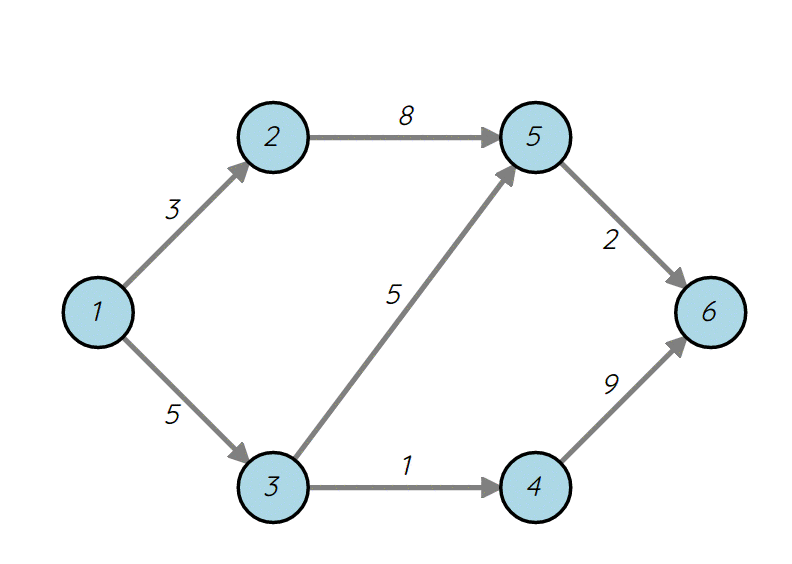
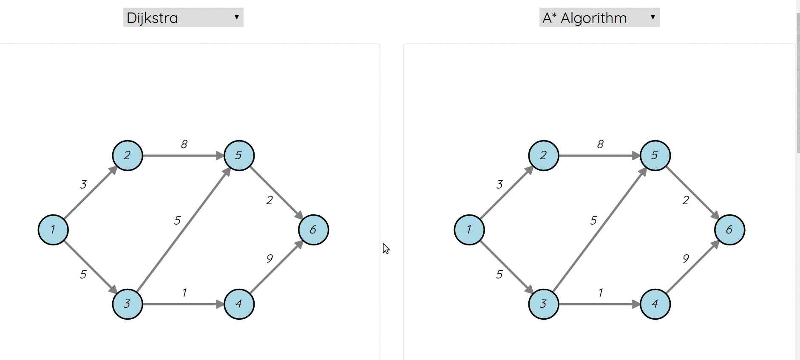
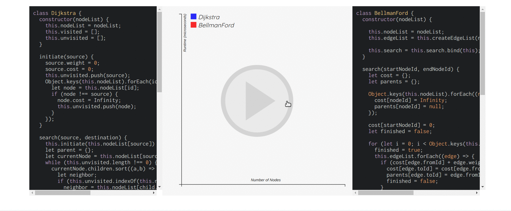

## Algo-Mapper

### Summary

While learning new algorithms, it is very common for users to get lost tracking variables, miss a conceptual step, and have trouble visualizing all the math into a physical model. So we built a full-stack web app that will allow users to walkthrough step-by-step through an algorithm and be able to compare the time-complexity of different algorithms.

[Live Link](http://algomapper.life)

### Technologies

##### _List of Technologies_

- Vanilla JavaScript
- React
- Django / Python
- react-highlight
- d3.js
- React-DOM
- Webpack

##### _Algorithm visualizations_

Visualizations were created using `d3.js`, a data visualization library for JavaScript. This was a clear choice over pure canvas or the `Easel.js` library. Both the algorithm show pages and the comparison page use `d3.js` to colorize pre-made node maps. Due to the nature of the algorithms, each visualization was built with a different modular approach, representing how the algorithm searches through the node map.

Figure 1: AStar algorithm displayed on show page

With our modular design, we can choose to show any sort of relative information needed.

Figure 2: Comparison page showing two different algorithms

In our comparison showpage, you can see the difference between different algorithms and what sort of information is needed and displayed. On the left of figure 2, you can see that visited nodes are important to the algorithm while on the right, you can see that an extra node needs to be highlighted and extra information is displayed on the top.

Figure 3: Graph and code displayed, along with the ability to re-calculate the data

As another point of comparison, the user is able derive and compare time complexities. Due to the random generator of nodelists, the solutions and runtimes can differ due to hitting worst-case scenarios. `d3.js` was also used to generate graphs to compare and display time complexity data for separate algorithms.

##### _Code Highlighting_

Although visualizations are helpful for understanding the core concepts of the algorithm, the pure code is of course another imperative. The show page and comparison both have code boxes that display JavaScript code that our team members developed, highlighted and formatted correctly using `react-highlight`.

### Future Plans

- Compare algorithms using different languages
- Compare algorithms with different optimized data structures (binary heaps, etc.)
- Show negative weight cases
- Add more user functionality/create own nodegraphs.

### Group Members

Our group consists of four members:

- Brandon Chui
- Janice Yura Lee
- Ranelle Reyes
- Winber Xu
